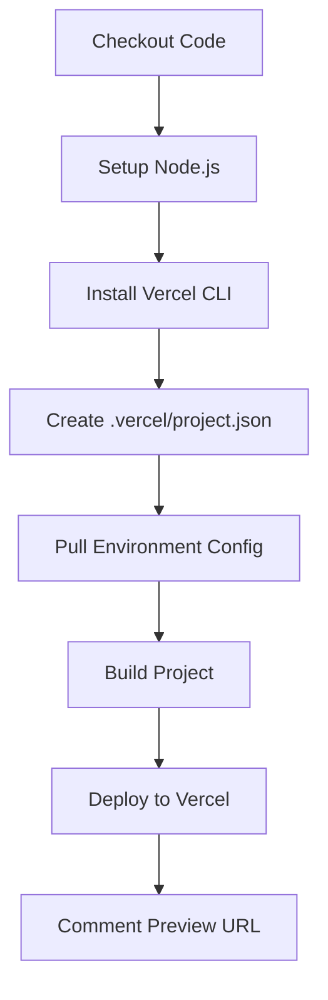

# GitHub Actions Fix Summary

## Issues Fixed

### 1. **Interactive Prompt Issue** ✅

**Problem:** The deployment workflow was hanging with the prompt:

```
? Set up and deploy "~/work/bitcoin-builder/bitcoin-builder"? [Y/n]
```

**Root Cause:** The `amondnet/vercel-action@v25` third-party action was attempting to interactively set up the Vercel project, which doesn't work in CI/CD environments.

**Solution:** Replaced the third-party action with the official Vercel CLI using non-interactive flags.

### 2. **Hardcoded Path in Documentation** ✅

**Problem:** `SETUP-CHECKLIST.md` contained a hardcoded absolute path specific to your local machine.

**Solution:** Replaced with generic placeholder that works for all users.

---

## Changes Made

### Updated Files

#### `.github/workflows/pr-preview.yml`

- ❌ Removed: `amondnet/vercel-action@v25`
- ✅ Added: Official Vercel CLI with proper workflow:
  1. Install Vercel CLI
  2. Create `.vercel/project.json` dynamically from secrets
  3. Pull environment configuration with `--yes` flag (non-interactive)
  4. Build project artifacts
  5. Deploy preview and capture URL

#### `.github/workflows/deploy.yml`

- ❌ Removed: `amondnet/vercel-action@v25`
- ✅ Added: Official Vercel CLI for production deployments:
  1. Install Vercel CLI
  2. Create `.vercel/project.json` dynamically from secrets
  3. Pull production environment with `--yes` flag (non-interactive)
  4. Build with `--prod` flag
  5. Deploy to production

#### `SETUP-CHECKLIST.md`

- Fixed hardcoded path `/Users/justinohalloran/Documents/justinohalloran/bitcoin/bitcoin-builder`
- Now uses generic placeholder `# cd /path/to/your/project`

---

## Key Improvements

### Non-Interactive Mode

All Vercel CLI commands now use the `--yes` flag to prevent interactive prompts:

```bash
vercel pull --yes --environment=preview --token=${{ secrets.VERCEL_TOKEN }}
```

### Dynamic Project Configuration

The `.vercel/project.json` file is created dynamically from GitHub secrets:

```bash
mkdir -p .vercel
echo '{"orgId":"${{ secrets.VERCEL_ORG_ID }}","projectId":"${{ secrets.VERCEL_PROJECT_ID }}"}' > .vercel/project.json
```

### Modern Vercel CLI Workflow

Using the recommended three-step deployment process:

1. **Pull**: Download project configuration
2. **Build**: Build the project with Vercel's build system
3. **Deploy**: Deploy pre-built artifacts

---

## What You Need to Do

### 1. Ensure GitHub Secrets Are Set

Verify these secrets exist in your GitHub repository:

- `VERCEL_TOKEN` - Your Vercel API token
- `VERCEL_ORG_ID` - Your Vercel organization ID
- `VERCEL_PROJECT_ID` - Your Vercel project ID
- `NEXT_PUBLIC_SITE_URL` - Your site URL (e.g., `https://builder.van`)

**To check:**

1. Go to GitHub repo → Settings → Secrets and variables → Actions
2. Verify all four secrets are listed

### 2. Test the Workflow

The workflows should now run without hanging:

```bash
# Stage the changes
git add .github/workflows/pr-preview.yml .github/workflows/deploy.yml SETUP-CHECKLIST.md

# Commit the fixes
git commit -m "fix: resolve GitHub Actions interactive prompt issue"

# Push to your branch
git push origin my-new-branch
```

Then check the Actions tab to verify the workflow completes successfully.

### 3. Verify Deployment

Once the PR is created:

- ✅ CI checks should run and pass
- ✅ Preview deployment should complete (no hanging)
- ✅ Preview URL should be commented on the PR

---

## Technical Details

### Why This Works

The official Vercel CLI provides better control over the deployment process:

- **`--yes` flag**: Accepts all prompts automatically
- **`--token` flag**: Authenticates without interactive login
- **`--prebuilt` flag**: Deploys pre-built artifacts, faster and more reliable
- **Dynamic project.json**: No need to commit sensitive project IDs to repo

### Workflow Flow



---

## Troubleshooting

### If It Still Hangs

1. Check that all secrets are correctly set
2. Verify your Vercel token has not expired
3. Ensure the project ID and org ID match your Vercel project

### If Build Fails

1. Check the Actions tab for detailed logs
2. Verify environment variables are set correctly
3. Try running `vercel build` locally to test

### If Deployment Fails

1. Verify the Vercel project exists and is linked
2. Check that your Vercel token has deployment permissions
3. Review Vercel dashboard for deployment logs

---

## Additional Resources

- [Vercel CLI Documentation](https://vercel.com/docs/cli)
- [GitHub Actions Documentation](https://docs.github.com/en/actions)
- [Vercel Environment Variables](https://vercel.com/docs/concepts/projects/environment-variables)

---

**Status:** ✅ Ready to Test

The workflows should now run without interactive prompts. Test by pushing to a branch and creating a PR.
